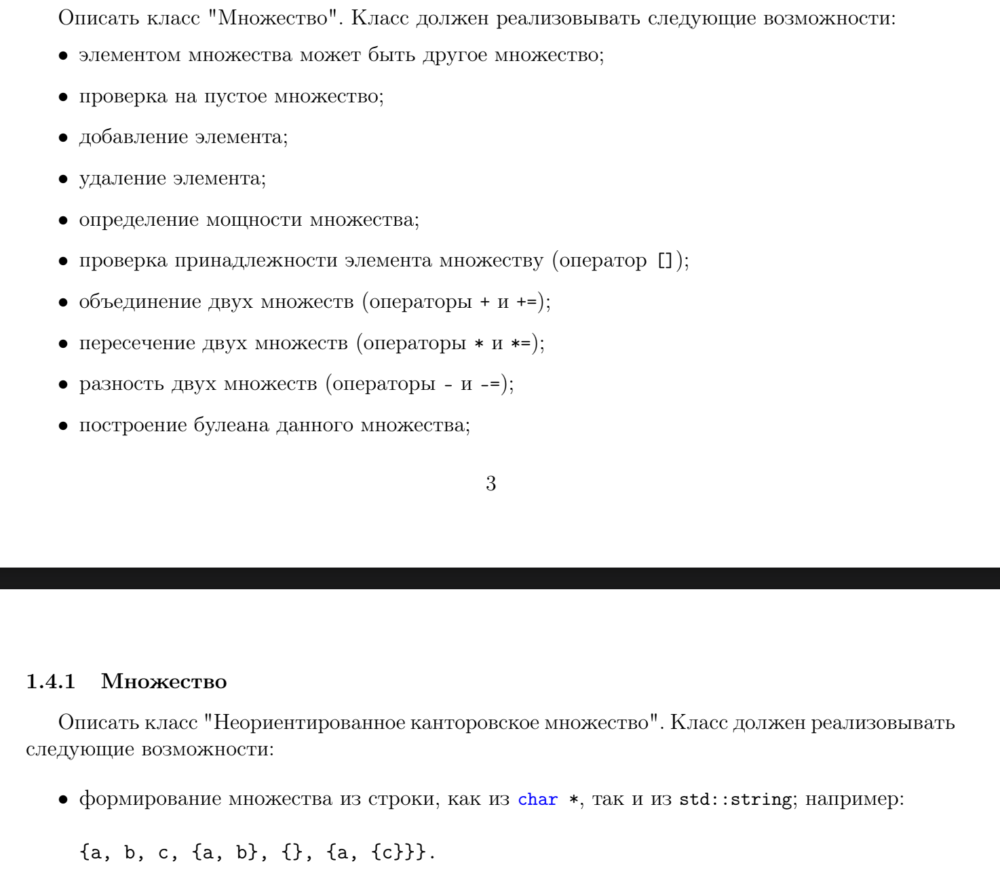
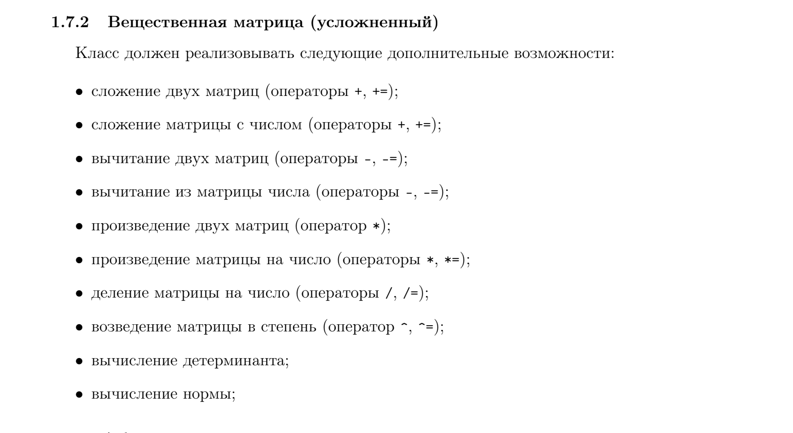
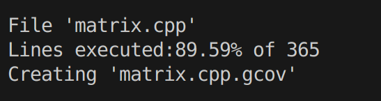
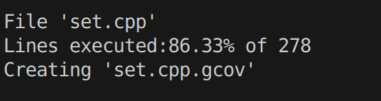

# Лабораторная работа №1 ППОИС
Мой вариант: матрица вещественных чисел и множество.

В моих программах есть система unit-тестирования, с помощью которой можно определить покрытие в процентах программы.  

Для реализации матрицы выполнено 35 тестов с таким процентом покрытия:

Для множество выполнено 22 теста с процентом покрытия: 

## Вещественная матрица 
Для реализации матрицы за основу был взят вектор веторов типа double. Этот тип из библиотеки stl позволяет забыть о очистке памяти. Программа способна выполнять разные функции по работе с матрицами: сложение, разность, умножение, деление, возведение в степень, нахождение нормы, определителя. Весь этот функционал реализован в методах класса Matrix. 

Для реализации множества за основу был взят вектор. Однако для того, чтобы реализовать вложенность нужен вектор типа std::variant<std::shared_ptr\<set>,int>. Был выбран именно shared_ptr именно для того, чтобы работа с памятью была удобнее. В классе set реализованa структура Parser, которая может обрабатывать ввод и записывать вложенные множества. Программа способна выполнять разные функции по работе с множествами: объединение, пересечение, разность, булеана.